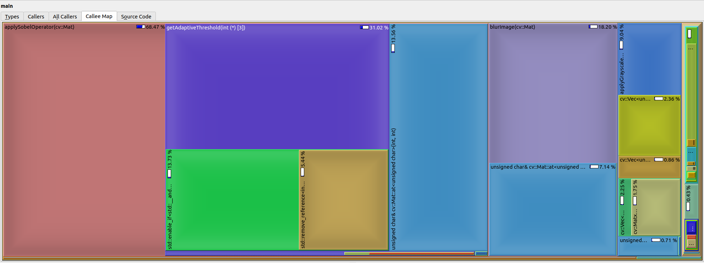

# Sobel Edge Detector

## APP & SM Project

**Codrut Ciulacu 344C1**

**Pana Adrian 344C1**

# Requirements

- #### C++ 17

- #### OpenCV

- #### Valgrind, Kcachegrind
```
sudo apt-get install libopencv-dev
sudo apt-get install valgrind
sudo apt-get install kcachegrind
```
# Usage
Add images to the [images](./images/) folder
```
make build
make run IMAGE=./images/image.jpg BLUR=true/false
make profile IMAGE=./images/image.jpg BLUR=true/false
```

# Description

This is a project originated from a university assignment meant to show the optimization of 
an advanced Sobel Edge Detection sequential algorithm through the use of different parallelization
techniques.

The [images](./images/) folder contains a few examples to play with, the results of the edge detection
being stored in the [edges](./edges/) folder.

The [BIG](./images/big.jpg) image is used for stress-testing, as it has very large dimensions.

# Roadmap

## Week 0
Implemented the [sequential version](./sobel_sequential.cpp) of the algorithm as a starting point.
We used OpenCV for the image extraction and (at first) for the grayscale
conversion. 

## Week 0.5
Modified the [sequential version](./sobel_sequential.cpp) to an explicit grayscale conversion.
Modified [Makefile](./Makefile) and source file, they now take the image path and threshold as
parameters.
Also added [input](./images/) and [output](./edges/) folders, with a few examples.

## Week 1

### Final sequential version updates
Fixed grayscale conversion to weighted average with weights 0.11, 0.59, 0.3 for R,G,B, as stated in [5].

We added a simple strategy to select an adaptive threshold for each 3x3 pixel window in the image inspired by [4].

We also added the option to blur[6] the image, by applying a blur kernel to the grayscale version, to get rid of anomalies.

### Profiling

Since adding the adaptive threshold, the runtime of the program has risen substantially.

We tested it on a quite large [image](./images/big.jpg) of 3MB (5266x3403 pixels) with the BLUR option added on top, and the result
was approximately 4 seconds.
We ran vallgrind on it and used kcachegrind to visualize the [callgrind](./profiling/callgrind.out.21931) results. Here is the Call Map:



As expected the Sobel Operator and the Adaptive Threshold computations take up most of the resources. These will be the focal point of the
optimization through parallelism. We will also include the grayscale and blur transformations to shave of some extra time.


# References

1. https://medium.com/@erhan_arslan/exploring-edge-detection-in-python-2-sobel-edge-detector-a-closer-look-de051a7b56df
2. https://homepages.inf.ed.ac.uk/rbf/HIPR2/sobel.htm
3. https://automaticaddison.com/how-the-sobel-operator-works/
4. https://iopscience.iop.org/article/10.1088/1742-6596/1678/1/012105/pdf
5. https://gist.github.com/SubhiH/b34e74ffe4fd1aab046bcf62b7f12408
6. https://www.youtube.com/watch?v=VL8PuOPjVjY&t=1s
