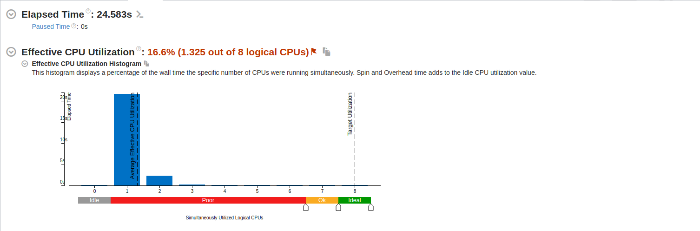
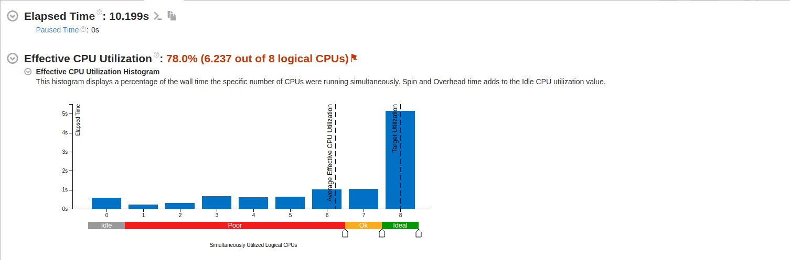

# Sobel Edge Detector

## APP & SM Project

**Codrut Ciulacu 344C1**

**Pana Adrian 344C1**

# Requirements

- #### C++ 17

- #### OpenCV
```
sudo apt-get install libopencv-dev
```
- #### VTune

# Usage
Add images to the [images](./images/) folder
```
make build
make run IMAGE=./images/image.jpg BLUR=true/false
make profile IMAGE=./images/image.jpg BLUR=true/false
```
Find the result in the [edges](./edges/) folder

For profiling, use 
```
kcachegrind callgrind.out
```
# Description

This is a project originated from a university assignment meant to show the optimization of 
an advanced Sobel Edge Detection sequential algorithm through the use of different parallelization
techniques.

The [images](./images/) folder contains a few examples to play with, the results of the edge detection
being stored in the [edges](./edges/) folder.

The [BIG](./images/big.jpg) image is used for stress-testing, as it has very large dimensions.

# Roadmap

## Week 0
Implemented the [sequential version](./sobel_sequential.cpp) of the algorithm as a starting point.
We used OpenCV for the image extraction and (at first) for the grayscale
conversion. 

## Week 0.5
Modified the [sequential version](./sobel_sequential.cpp) to an explicit grayscale conversion.
Modified [Makefile](./Makefile) and source file, they now take the image path and threshold as
parameters.
Also added [input](./images/) and [output](./edges/) folders, with a few examples.

## Week 1

### Final sequential version updates
Fixed grayscale conversion to weighted average with weights 0.11, 0.59, 0.3 for R,G,B, as stated in [5].

We added a simple strategy to select an adaptive threshold for each 3x3 pixel window in the image inspired by [4].

We also added the option to blur[6] the image, by applying a blur kernel to the grayscale version, to get rid of anomalies.

## Week 2
We enhanced the algorithm to take as an input a video and output the video where we detected the edges for each frame 
and streamed it to the result.

## Week 3
We started work on the intuitive [pthreads](./sobel_pthreads.cpp) implementation and profiling. 

## Approach
Our approach was to run the filtering in parallel on a number of threads equal to the machine's CPUs, by splitting the video in multiple batches
that can be processed at the same time, since the main work is done by applying the operations individually on each frame.
of processing one frame. 
After all the batches are processed, we link them back together into a bigger video.

This way we managed to achieve a speedup of around 2.41.

## Week 4
- Implemented a [pthreads version](./sobel_pthreads.cpp) that also processes applying the sobel operator on a single frame in parallel.
- Implemented 2 MPI versions, [one](./sobel_mpi.cpp) that splits frame batches between processes, and [one](./sobel_mpi_extra.cpp) that, similarly to
the pthreads implementation, splits each frame between more processes.

## Week 5
- FFMPEG usage to link resulted videos back together.
- OpenMP implementation 

# Implementation + Profiling
## Sequential Version



The initial result took over 24s for a 6s long video. As you can see from the 
screenshot above only 16% of the CPUs were used by this version(1.325 logical CPUs 
out of 8 cores available). Under the hood the OpenCV already does some work on
multiple threads(reading and writing the video file in general).

We identified some hotspots for our application as we described in the table below.

| No.| Function name         | Usage |
|----|-----------------------|-------|
| 1  | processFrame          | 73.6% |
| 2  | applySobelOperator    | 45%   |
| 4  | getAdaptiveThresshold | 17%   |
| 3  | blurImage             | 15.6% |
| 4  | Mat.at                | 12.3% |
| 5  | applyGrayscale        | 11.2% |       

We will be focusing our attention on the main processing function and the function
that applies the Sobel operator as the are the ones that take the most out of
our computation workload.

As we can further identify any speedup we will try to run in parallel the other functions too.

## Pthread Version
### Initial approach

As seen before the main chunk of work that our program is doing in the sequential implementation is to process the 
frame because this part applies on the image multiple algorithms.
So naturally the first thing we did for the Pthread implementation was to create multiple thread, each one processing a batch
of frames from the total pool, this way we can do more frames in parallel.

But then we encountered an interesting problem. OpenCV has the ability to create a VideoWriter objects, that works as a C++ stream.
We can output the data through that stream to a specific file created by the program. The only problem is that the VideoWriter 
needs to write the frames in order otherwise it will crash. With multiple frames processed that computed the final result this cannot 
be achived very easy. We took into consideration multiple solutions like a simple buffer to store the frames in order and then
iterate over it an write to the output file, but this is very expensive as the videos are growing bigger.

In the end we decided that each thread will write to a separate file and then we will concatenate them using FFmpeg.
This way we can offload some of the work to ffmpeg to be optimised. The downside is that FFmpeg hides the concatantion
logic so we cannot optimise it by running it in parallel.



### Second implementation
The natural thing to do was to take the next function that consumes most of the program which is the function that applies
the Sobel operator in the greyscaled image. The way we did it is to spawn other N threads from the thread we already created.
This way we will use N + 1 threads because the master thread that created the other threads will try itself to run the function.
Now we just need to split the image rows in N+1 segments and process it in parallel.

The total number of threads used should optimally be close to the number of cores that the system is using, but we managed to see
good results with even more threads. 

## OpenMP Version
The OpenMP solution is quite similar to the Pthreads one in the sense that both solution split the video in equal size 
segments to be processed in parallel. Then we split each frame's rows in multiple parts. The implementation is based mostly 
on the `parallel for` preprocessor instruction which will split the for iteration on multiple threads and then join them after 
everything is done. 

One optimisation that we've done is to use the dynamic scheduling for the thread that applies the Sobel operator. We couldn't 
do it for for the function that process a segment of the frames because it needs to write the frames in order to the writer and
we saw that sometimes due to each frame being simpler or more complex it usually did write a frame ahead of the one that was 
supposed to be written. But for the function that applies the Sobel operator we don't have that restriction as the function 
takes a frame and returns back the computed matrix. And this works great as some regions of the image may be denser and 
may require harder computations by a some threads.

## MPI Version
### Initial Approach
As we did for the previous solutions we started from something simpler and then moved forward to 
a better approach. We started by processing each frame on multiple MPI processes. The ROOT process
would start by assinging each process a segment of the video by sending to them the starting frame
and the ending frame indexes. Then each process would read its part from the video and process it.
At the end each process would produce a different video and the ROOT process would merge it into a single output.

### Final result
The second solution implies the further splitting of each frame on multiple processes.
Something like the Pthreads solution we made the difference between 2 types of processes:
  - Master: That would read a parat of the video and send over to the slaves
  - Workers: that would apply the Sobel operator on a part of the frame
We would define a RATIO macro that would tell us the ratio of master/worker processes. If we have
16 processes assigned and we have a ratio of 4 then we will have 4 master processes and each
master would have 4 workers.
Then the algorithm works as explained above: 
  - Each master would read the assinged segment and share it with the workers
  - Each worker would process a part of the frame and send back to the master
  - The master would write to the output the final frame
  - At the end the ROOT process would use ffmpeg to concatenate the result


# References

1. https://medium.com/@erhan_arslan/exploring-edge-detection-in-python-2-sobel-edge-detector-a-closer-look-de051a7b56df
2. https://homepages.inf.ed.ac.uk/rbf/HIPR2/sobel.htm
3. https://automaticaddison.com/how-the-sobel-operator-works/
4. https://iopscience.iop.org/article/10.1088/1742-6596/1678/1/012105/pdf
5. https://gist.github.com/SubhiH/b34e74ffe4fd1aab046bcf62b7f12408
6. https://www.youtube.com/watch?v=VL8PuOPjVjY&t=1s
